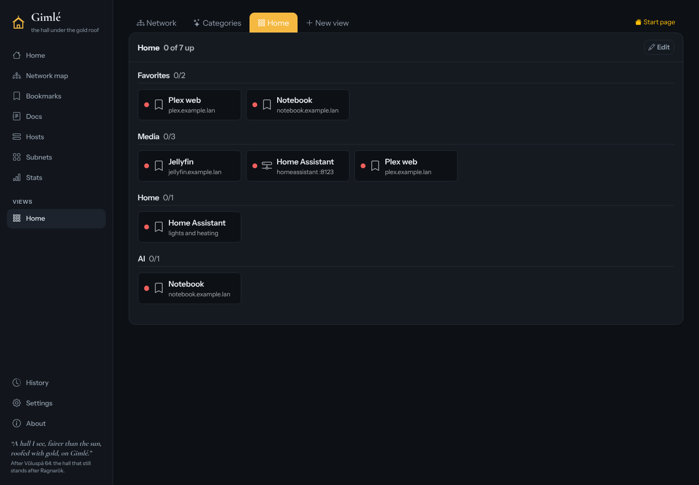
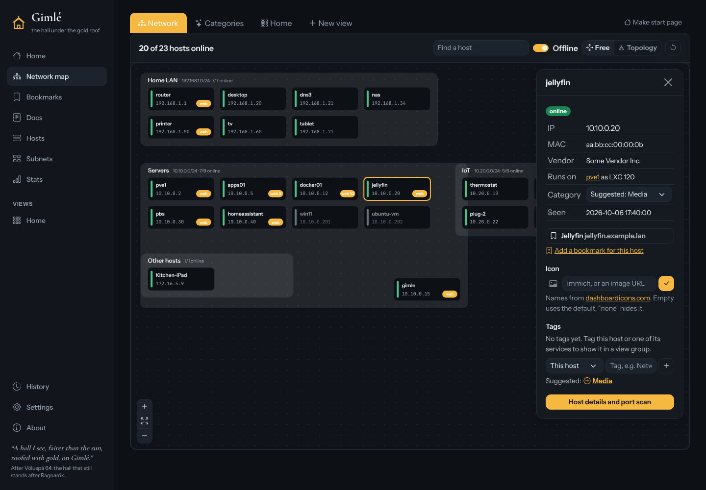
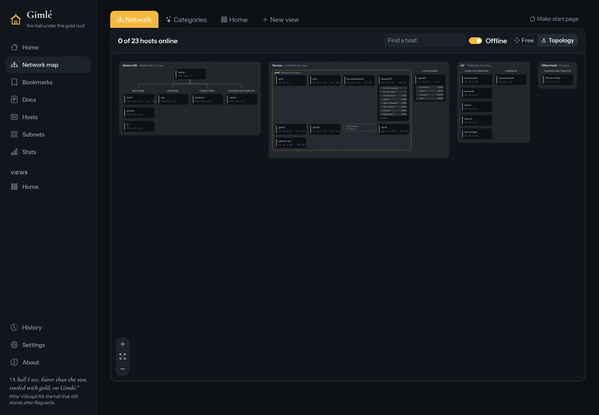
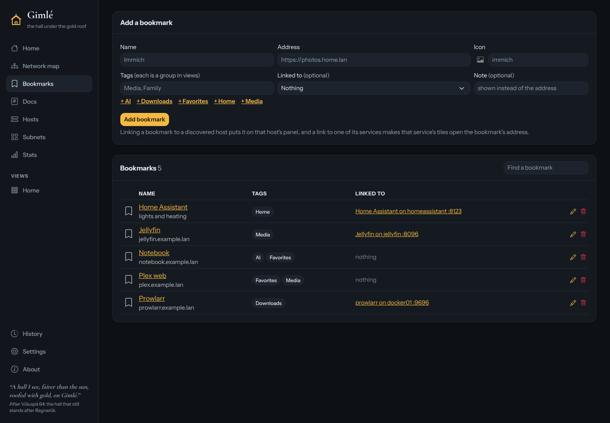
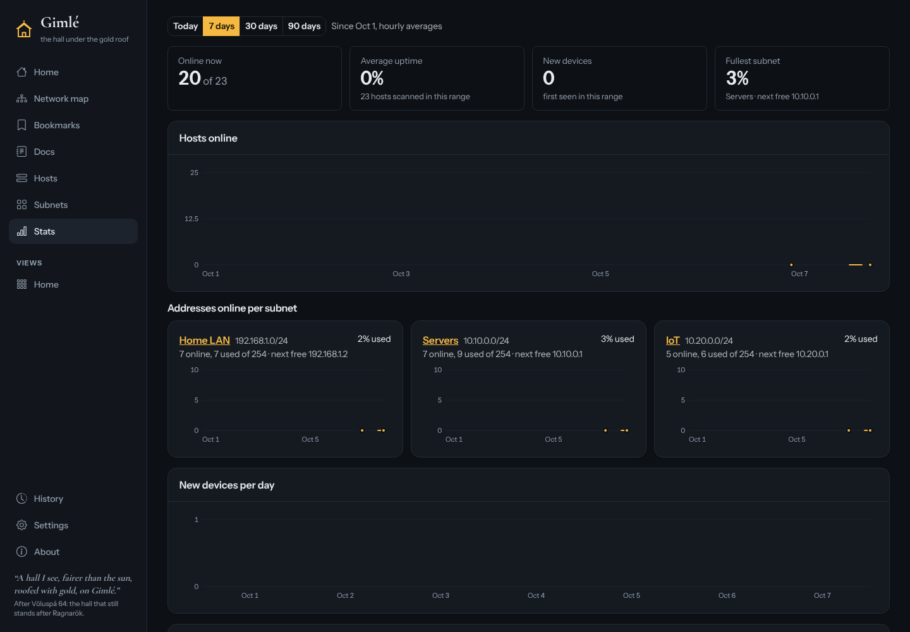
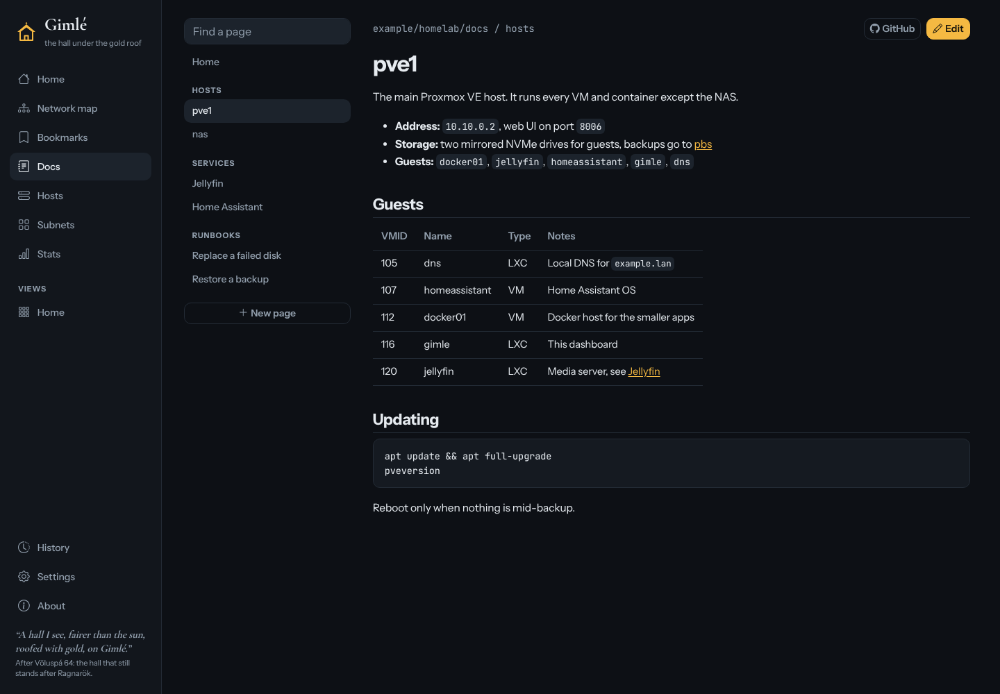
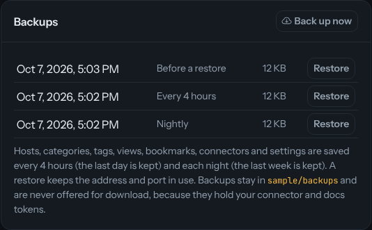

# Gimle

A home lab dashboard that finds the devices on your network and lays them out as a clickable map, with a start page of bookmarks, uptime stats and your lab's documentation alongside.



## What it does

- **Discovers hosts** on the subnets you choose (arp-scan), names them from DNS, mDNS and NetBIOS, and checks their open ports and web pages.
- **Maps them**, either laid out by hand or as an automatic topology with Docker containers and Proxmox guests inside their hosts.
- **Reads other systems** you may already run: Docker, Dockhand, Scanopy, UniFi, Technitium DNS and Proxmox VE (read only), and turns the sites Caddy proxies into bookmarks.
- **Replaces a homepage** like Dashy: bookmarks with tags, views of tiles or maps, and a start page of your choice.
- **Shows uptime** and how full each subnet is, over up to 90 days.
- **Shows your docs**: Markdown pages kept in a GitHub repository, editable from Gimle when you give it a token.
- **Backs itself up** every 4 hours and nightly, with a one-click restore in Settings.

| | |
|---|---|
|  |  |
|  |  |
|  |  |

The screenshots use sample data.

## Install

On a Proxmox host, this creates a small Debian 12 container (512 MB) and starts Gimle on port 8840:

```
bash <(curl -fsSL https://raw.githubusercontent.com/vipthomps/Gimle/main/proxmox/gimle-lxc.sh) --bridge vmbr0
```

Update it later from the Proxmox host with:

```
pct exec CTID -- update
```

`update` downloads the latest release and checks its checksum, so nothing is built in the container. The [guide](docs/guide.md) covers every option, page and setting.

## Please read before you use it

- **Made with Claude.** Gimle was written with [Claude Code](https://claude.com/claude-code), an AI coding assistant, under my direction. I have not audited it, and I make no representations that the code is secure, correct or fit for any purpose. Use it at your own risk.
- **Built for my home lab.** It fits the network and tools I run (Proxmox, UniFi, Technitium, Docker, Dockhand, Scanopy). Yours may need changes, and I can't promise support.
- **HTTP on purpose.** Gimle serves plain HTTP. Put HTTPS, and a login if you want one, in front of it with your reverse proxy (Caddy, Nginx Proxy Manager, Traefik).
- **No login.** Anyone who can reach it can change its settings, and commit to your docs repository if editing is on. Keep it on a trusted network. The automatic backups are there so a bad change is easy to roll back.
- **Only scan networks you own** or have permission to scan.

## The name

In Norse myth, Gimlé (from Old Norse *gimr*, "fire, sparkling", and *hlé*, "shelter") is the gold-roofed hall that the Völuspá and the Prose Edda say stands after Ragnarök, a refuge when everything else has fallen. A home lab dashboard is a much smaller shelter, but it is the page you want still standing when something breaks.

## Credits and license

Gimle began as a fork of [WatchYourLAN](https://github.com/aceberg/WatchYourLAN) by aceberg, and keeps its MIT license. See [LICENSE](LICENSE).
